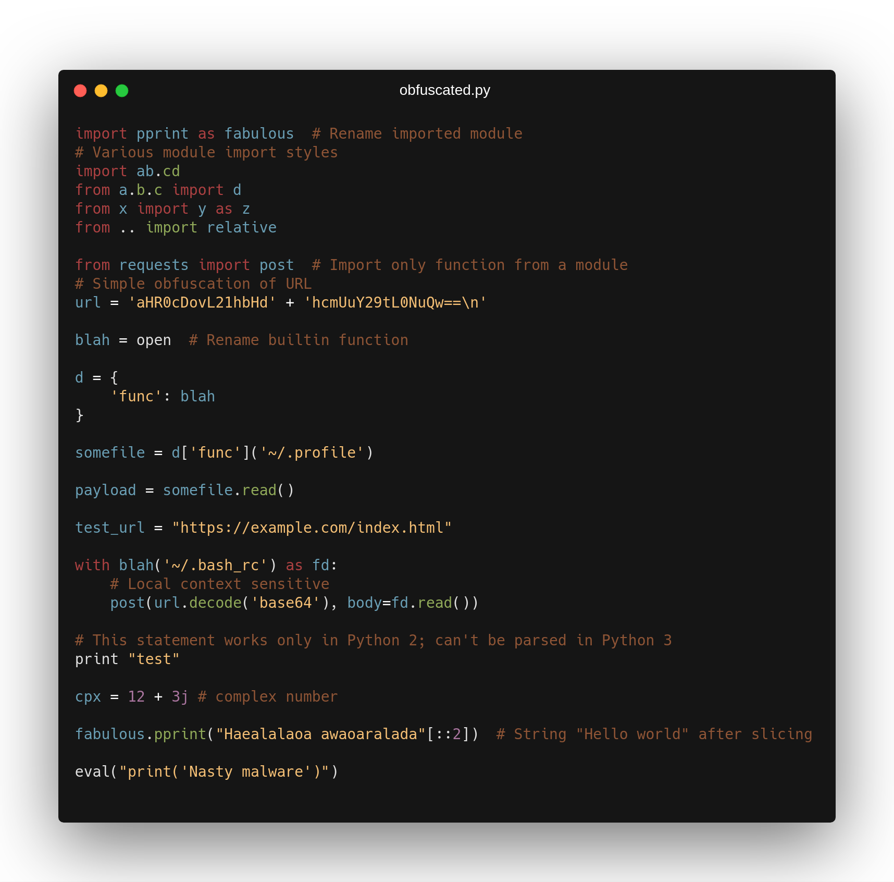
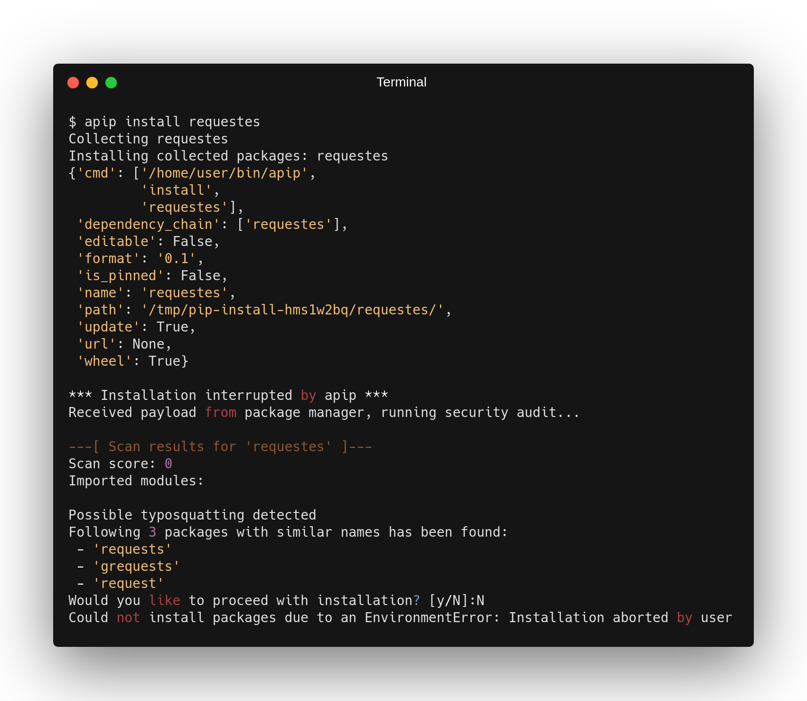

# Project Aura: Security audits for packages

# About the problem

The current trend in the development is to use a lot of packages in the development phase, even if they provide only trivial functionality and consist of 11 lines of code. When we combine this with very liberal policies of publishing new packages, we now see a rise up in malicious attacks targeting the developers. There have been several different approaches by threat actors:

- typosquatting attacks with a misspelled name that can be installed by an accident
- bait packages with attractive names trying to lure developers into installing them
- hijacking existing packages via credentials leaking from GitHub commits or other sources

Those are just a few examples of the techniques by which a developer can compromise himself. This is supported by the fact that there is no monitoring process over what is uploaded to the repositories such as PyPI or NPM, and a stroke of sheer luck has discovered the previous incidents. Our goal is to improve that.

## Aura framework
We created a framework that is designed to scan source code on a large scale (such as the whole PyPI repository), looking for anomalies and potentially malicious intent as well as vulnerabilities. This framework is designed to also scan source code on demand such as when a package is installed by a developer or just any set of files/directories. The implementation is currently targeting Python language and PyPI, however, it is designed to provide an ability to include other languages. (such as Javascript and NPM)

The set of use cases include, but not limited to:

- provide an automated monitoring system over uploaded packages to PyPI, alert on anomalies that can either indicate an ongoing attack or vulnerabilities in the code
- enable an organization to conduct security audits of the source code and approve code dependencies before developers use them
- protect developers when installing an external package, package installations are intercepted and scanned by Aura analyzer for anomalies and characteristics

A highly optimized hybrid analysis engine achieves this. An analysis is performed in a completely safe environment using static code analysis without any code execution. The aura core engine is analyzing the AST tree parsed from the source code, performing behavioral analysis and code execution flow. The engine also has support for rewriting the AST tree using a set of rules such as constant propagation, folding or static evaluation; these are a set of techniques that compilers use to optimize the code. This is the reason why this analysis approach is "hybrid" as it enhances static analysis with a completely safe partial evaluation which allows us to defeat simpler obfuscation mechanism.

Below, you can see a showcase of different source code "obfuscation" techniques recognized by the Aura AST transformation engine:

To learn and start using the framework, read the [installation, configuration](docs/install.md) and [usage](docs/running_aura.md) documentation.

### Aura scanner

The core part of the Aura is analyzing the source code for anomalies or potential vulnerabilities. Aura has several built-in analyzers that look for anomalies such as usage of eval in the setup script; other analyzers look at file system structure (non-source code) looking for example for leaking credentials, hard-coded API tokens, etc. These analyzers generate what we call **hits** that define the anomalies found and can also include a score, that is used to compute to security aura of the scanned data. It is advised to use a reasonable judgment of the presented anomalies based on the functionality of the input data. For example, it is completely normal for a *requests* library to include network-related calls while at the same time, it is not expected for an image processing library to send data over the network. There is also support for outputting data into JSON format suitable for massive repository scans or integration into other products. For description and usage of other components consult the [documentation]((docs/running_aura.md)).

##Documentation

- [Installation and configuration](docs/install.md)
- [Using and running Aura](docs/running_aura.md)

## Authors

* **Martin Carnogursky** - *Initial work* - [Martin Carnogursky](https://is.muni.cz/person/410345)

## License

This project is licensed under the GPLv3 License - see the [LICENSE.txt](LICENSE.txt) file for details. Parts of this framework contains (optional) integrations with other products such as the [r2c platform](https://returntocorp.com/), [libraries.io](https://libraries.io/api), etc.; which are subjected to their license and terms of usage.

